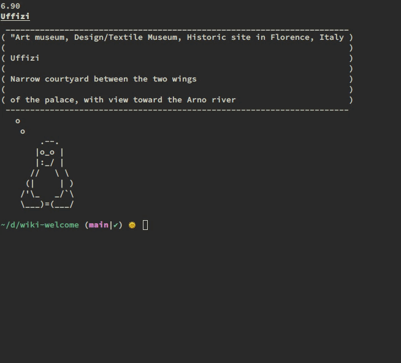

# wiki-welcome



A welcome banner for your shell which selects a few lines from a random Wikipedia article.

I included some 800 random Level-5 Vital Wikipedia articles so the topics won't be too unimportant.

## To install:

```
git clone --depth=1 https://github.com/chapmanjacobd/wiki-welcome/ ~/bin/wiki-welcome/
```

### Fish

```fish
function fish_greeting
    cat /proc/loadavg | cut -d' ' -f 2
    set article (/usr/bin/ls -p  ~/bin/wiki-welcome/articles/ |grep -v / | shuf -n 1)
    set_color -o -u
    echo (string replace '_' ' ' (string replace '.txt' '' (string unescape --style=url $article))) | sed 's/.*/\L&/; s/[a-z]*/\u&/g' | sed -E 's/ (The|A|Of|I[sn]|For)\b/\L&/g'
    set_color normal
    head -c500 ~/bin/wiki-welcome/articles/$article | cowthink -W 78 -f tux
end
```

Alternatively, for more randomness you can change `head` to `shuf` like this:

```sh
shuf -n7 ~/bin/wiki-welcome/articles/$article | cowthink -W 78 -f tux
```

This repo uses material from Wikipedia, which is released under the <a href="https://creativecommons.org/licenses/by-sa/3.0/">Creative Commons Attribution-Share-Alike License 3.0</a>. Respective authorship can be found on the page of each article.


PRs are welcome--except for adding more wikipedia articles. I can add all Level-5 Vital articles just fine but it is over 1GB so...
